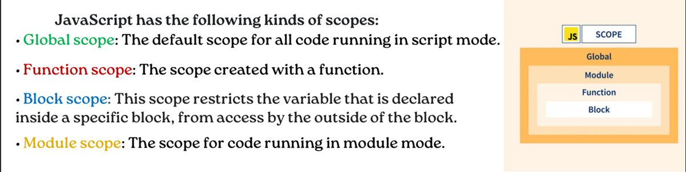

# `Что такое Scope в JavaScript`
## Область видимости или Scope. Область видимости (scope) определяет видимость или доступность переменной (другого ресурса) в области твоего кода. Глобальная область видимости или Global Scope. В JavaScript есть только одна глобальная область.

# `Что такое Hoisting в JavaScript`
## Поднятие или hoisting — это механизм в JavaScript, в котором переменные и объявления функций, передвигаются вверх своей области видимости перед тем, как код будет выполнен. Как следствие, это означает то, что совершенно неважно где были объявлены функция или переменные, все они передвигаются вверх своей области видимости, вне зависимости от того локальная она или же глобальная. 

# `Hoisting Верейбл var`
## Запуск JavaScript происходит на этапе создания контекста выполнения, который перемещает объявления переменных и функций в начало скрипта. Движок JavaScript запускает переменные, объявленные с использованием ключевого слова let, но не инициализирует их как переменные, объявленные с помощью ключевого слова var.

# `Hoisting Fuction Declaretion`
## Hoisting (поднятие) — это механизм в JavaScript, в котором переменные и объявления функций передвигаются вверх своей области видимости перед тем, как код будет выполнен.

